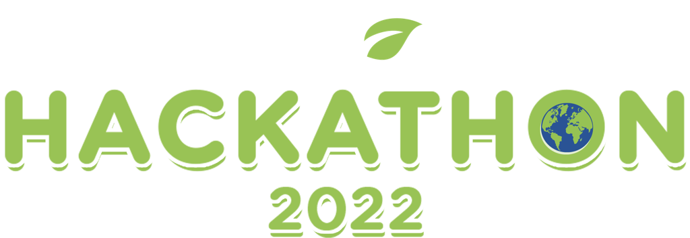
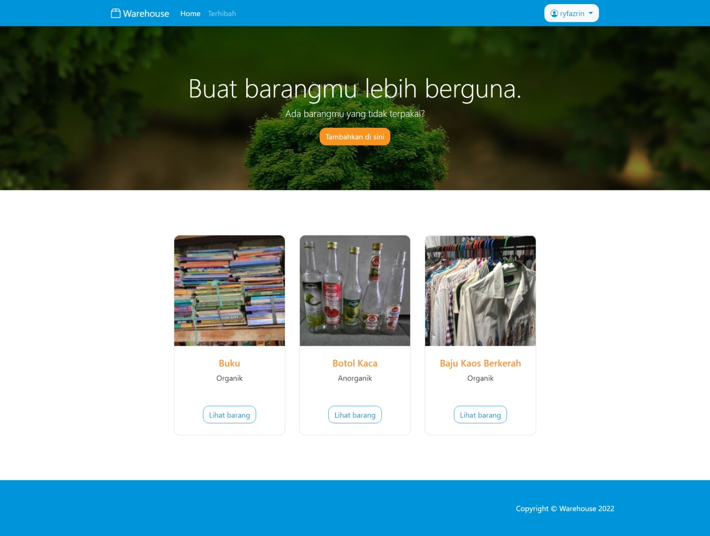
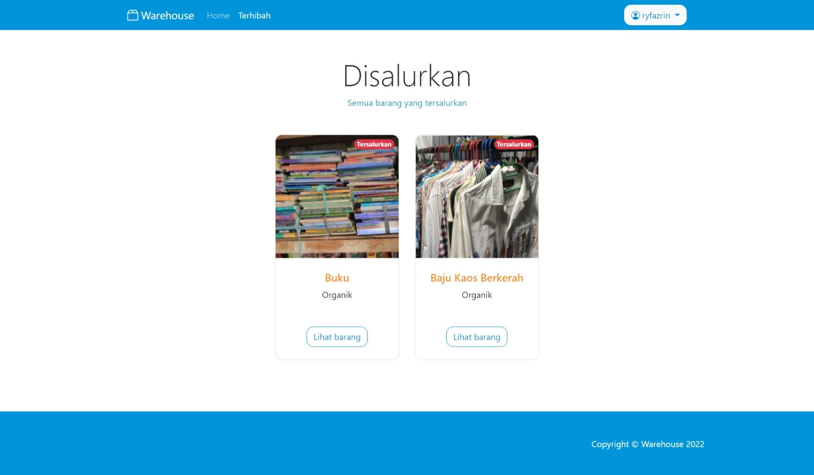
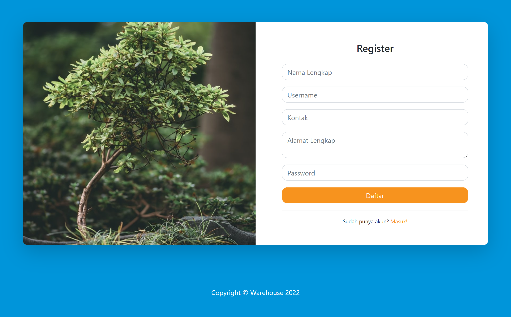
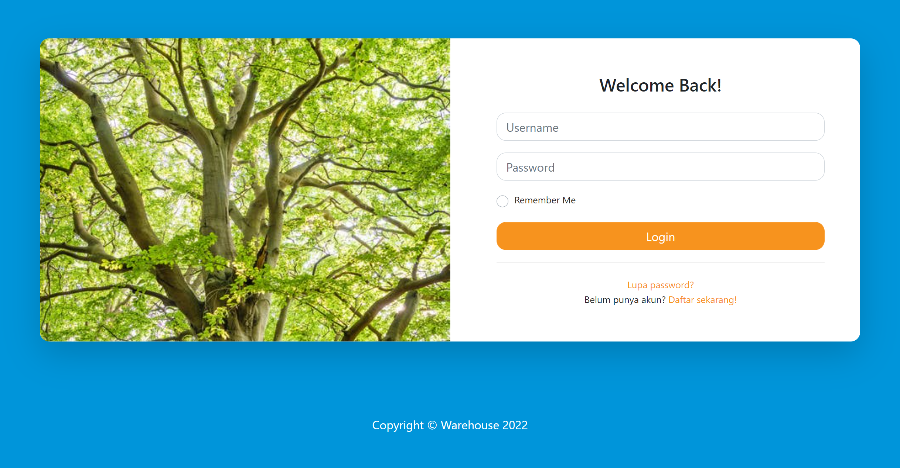
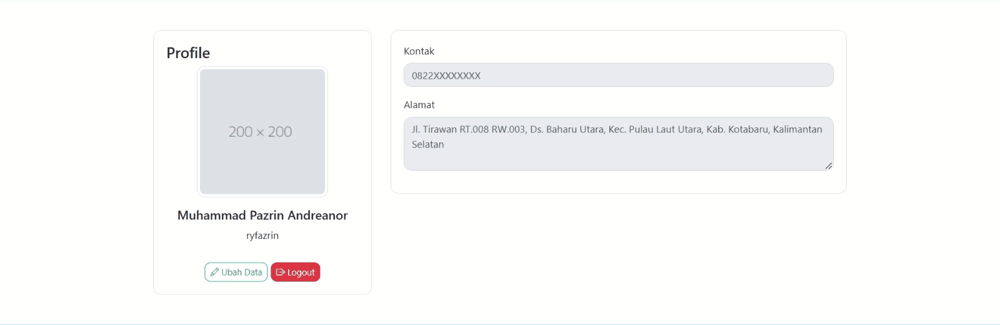
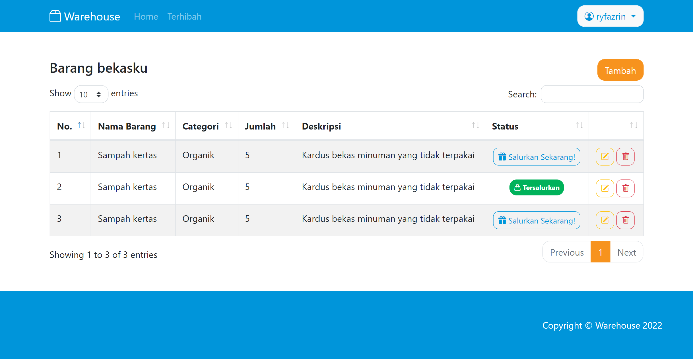
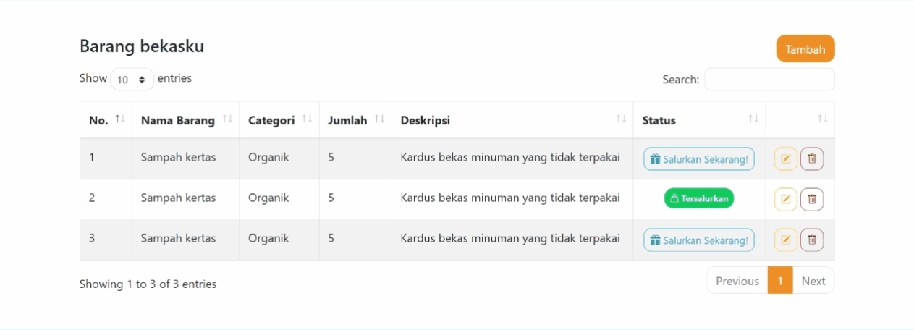

# Warehouse

Warehouse is a prototype application made by **Hackalhot**
as an entry for **Blibli Cinta Bumi 2022 Hackathon**.

The Goal of **Warehouse** is to help bridge the gap between users who want to 
donate or give their **used / unused** or **recyclable** items to **save the world**.

## Home
### Dashboard

### Donated Items

## User Pages
### Register and Login

### User Profile

### User Items

